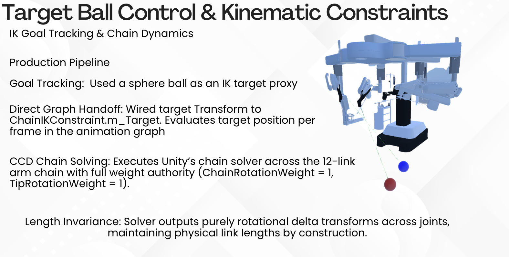
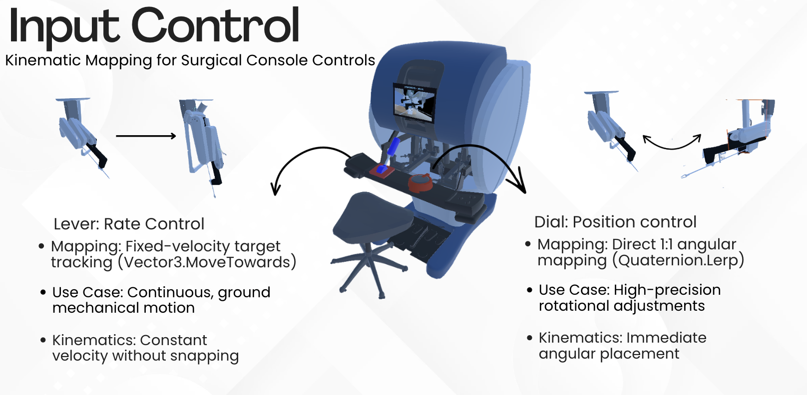
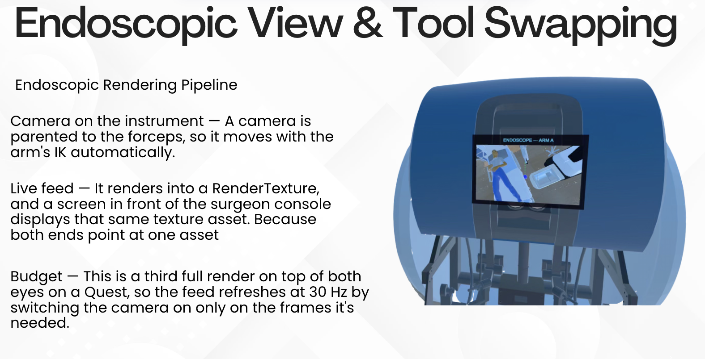
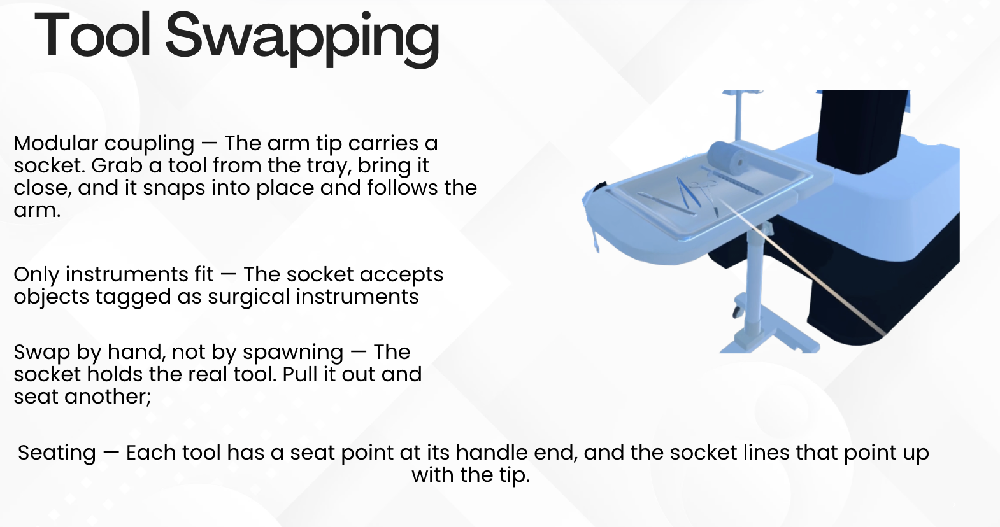
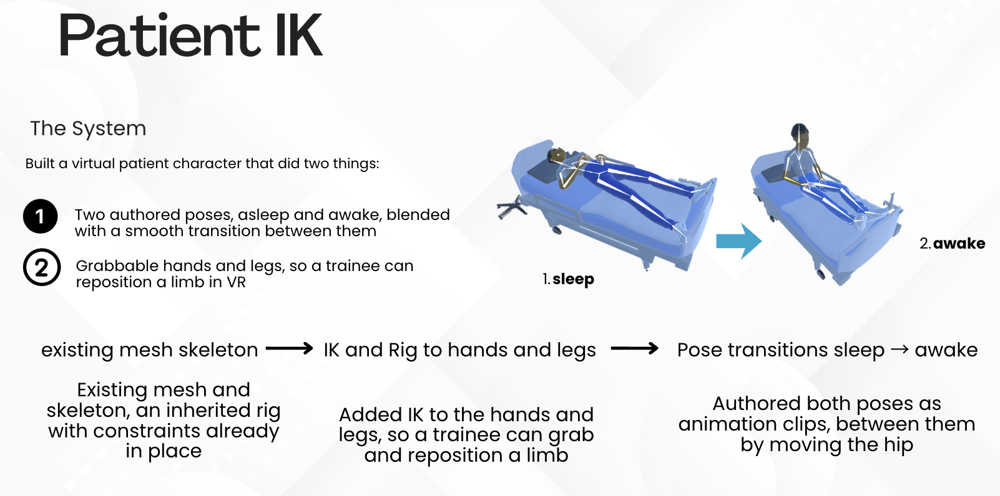

# Da Vinci Surgical Robot — VR Trainer

A multiplayer virtual-reality simulator of a da Vinci robotic surgical system, built in Unity 6 for Meta Quest. The user can stand in a hospital room beside a patient on the bed, drive the robot's instrument arms by hand and from the surgeon console, watch a live endoscopic feed, swap instruments at the arm tip, and see every joint's motion charted in real time. This application is to showcase Kinematics with Unity Physics.

**Unity 6000.4.0f1** · URP 17.4 · OpenXR · XR Interaction Toolkit 3.4 · Animation Rigging 1.4 · Netcode for GameObjects 2.10

---

## What you can do in the headset

| | |
|---|---|
| **Drive the arms** | Grab a target ball and the instrument arm reaches for it, joint by joint. |
| **Use the console** | Levers drive joints at a controlled rate; a dial aims a joint directly. Let go and the arm holds its position. |
| **See through the instrument** | A camera on the arm tip streams a live endoscopic view to a monitor at the surgeon console. |
| **Swap instruments** | Pick tweezers, clamps or a scalpel off the tray and seat it on the arm tip; it snaps into place and follows the arm. |
| **Watch the telemetry** | Live speed-over-time and distance-over-time charts for each arm, colour-matched to angle overlays on the joints themselves. |
| **Wake the patient** | One button moves the patient from asleep on the bed to sitting up, with an animated transition. Their hands can be grabbed and repositioned. |
| **Train together** | Several people share the room over the network, built on Unity's VR Multiplayer template. |
| **Freeze everything** | The **A** button pauses the machine and the charts together, to discuss a pose. |

---

## Features in detail

### Robotic arms and inverse kinematics

Each instrument arm is a chain of joints solved by an Animation Rigging `ChainIKConstraint`. The constraint's target is a grabbable, networked ball floating in world space; the solver reads that ball's position every frame and rotates each joint, from the rotary base out to the tip, to bring the instrument to it. Because the solver only ever produces rotations, link lengths hold by construction — nothing stretches.



- **Console driving** — `DaVinciArmConsole` moves an arm's IK target from the console controls, and steps aside the moment someone grabs the target directly, so the hand and the console never fight over it.
- **Reset** — `NetworkedPoseReset` returns a target ball to its starting point, which walks its arm home with it.
- **Pause** — `DaVinciPauseControl` freezes the machine and everything reading from it on a controller button.

### Console levers and dial

The two control types are deliberately different, because they mean different things:



- **Lever — rate control** (`LeverDrivenRotator`). A lever names a *direction*. The joint travels toward that end at a fixed speed and stops at its limit. It holds position whenever the lever isn't being held, so an arm can be parked mid-travel.
- **Dial — position control** (`KnobDrivenRotator`). A dial names an *angle*. Its value maps straight onto the joint's rotation.

Neither contains networking code. The networked lever and dial already replicate their own value, and every client derives the same joint angle from it — so there is one source of truth rather than two that can disagree. Both write their rotation in `LateUpdate`, after the rigging graph has run, and both recompose from the captured rest pose each frame so the joint never drifts over a long session.

### Endoscopic view

A camera is parented to the instrument tip and renders into a RenderTexture that a monitor in front of the surgeon console displays (`EndoscopeCamera`).



- A 5 mm near clip — a real endoscope works centimetres from tissue.
- Single-eye rendering, so the feed isn't drawn twice for VR.
- The monitor lives on the UI layer, which the endoscope doesn't render — otherwise the camera would film its own screen.
- The feed refreshes at 30 Hz to protect the Quest's frame budget; it's a third full render on top of both eyes.

### Instrument swapping

The arm tip carries a coupling built on XR Interaction Toolkit's `XRSocketInteractor` (`DaVinciInstrumentMount`). It accepts only objects marked as surgical instruments (`DaVinciInstrument`) and ignores everything else in the room. The socket holds the actual tool — nothing is destroyed or spawned — and the arm's fixed forceps is hidden while a tool is seated. Each tool seats by a mount point at its handle end; tools that miss the coupling fall under gravity.



### Telemetry and visualisation

- **`DaVinciTelemetryGraph`** — scrolling speed and distance charts per arm. Drawn into a single `Texture2D` rather than as UI meshes, so ten traces cost the same as two, and backed by a fixed-size ring buffer so a long session never grows its memory.
- **`JointAngleVisual`** — an angle wedge in each joint's own plane of rotation, labelled in degrees.
- **`DaVinciIkChainVisualizer`** — the solved chain as a skeleton, with the line from tip to target.
- **`TipForceVisual`** — an arrow at each instrument tip showing which way and how hard it's being driven.
- **`DaVinciJointPalette`** — one colour per joint, shared by the charts and the wedges, so a trace and its joint are the same colour.

### Patient

The patient moves between two authored poses — asleep, and sitting up in bed — through an Animator crossfade (`HumanoidPoseLibrary`), driven by the Resting and Wake Up buttons on the bedside panel. Each hand can be grabbed and repositioned: a `TwoBoneIKConstraint` bends the shoulder and elbow to follow, so the mesh doesn't stretch (`GrabbableLimbIK`). The constraint only engages while a hand is held, leaving the pose animation in charge the rest of the time.



### Environment

The hospital room ships on the Built-in render pipeline; its 70 materials were converted to URP Lit, remapping textures, normal maps, emission and transparency so the room renders correctly under URP.

---

## Getting started

**Requirements**

- Unity **6000.4.0f1** (install the exact version through Unity Hub)
- Android Build Support, for a Quest build
- **Git LFS** — models, textures and audio are stored with LFS

**Clone**

```bash
git lfs install
git clone https://github.com/ZaidKamil1574/Da-Vinci.git
```

Cloning without Git LFS gives you small pointer files in place of every model and texture, and the scene will open with missing or pink assets. If that happens, run `git lfs pull` inside the repository.

**Run**

1. Add the folder in Unity Hub and open it with 6000.4.0f1. The first import takes several minutes.
2. Open `Assets/Scenes/SampleScene.unity` — the only scene in the build.
3. Press Play with a Quest connected over Quest Link, or use the XR Interaction Toolkit's XR Device Simulator to drive it with mouse and keyboard.
4. To build for Quest, switch the platform to Android and build `SampleScene`.

---

## Project layout

```
Assets/
├── DaVinci/
│   ├── Scripts/            all project code (below)
│   └── Generated/          baked pose clips, animator controllers, the endoscope RenderTexture
├── Scenes/SampleScene.unity
├── Hospital Room 2/        hospital environment (third-party, converted to URP)
├── VR Body/                patient characters
├── Da+Vinci.fbx            robot model
├── Robotic Surgery Controller.FBX   surgeon console
└── VRMPAssets/             Unity VR Multiplayer template
```

```
Assets/DaVinci/Scripts/
├── Controls/        LeverDrivenRotator, KnobDrivenRotator, DaVinciPauseControl, NetworkedPoseReset
├── Endoscope/       EndoscopeCamera
├── Instruments/     DaVinciInstrument, DaVinciInstrumentMount
├── Patient/         HumanoidPoseLibrary, GrabbableLimbIK, PatientPoseController, PatientLimbHandle
├── UI/              DaVinciTelemetryGraph, DaVinciControlPanel, FaceViewer
├── Visualization/   JointAngleVisual, JointMotionTracker, DaVinciIkChainVisualizer, TipForceVisual, DaVinciJointPalette
├── Editor/          scene-setup tooling (below)
├── DaVinciArm.cs, CcdSolver.cs, RevoluteJoint.cs, DaVinciTrocarPort.cs, DaVinciArmGrabHandle.cs
└── DaVinciArmConsole.cs, XRLever2D.cs
```

---

## Editor tooling

Scene wiring is done by editor commands rather than by hand, because the model's hierarchy is deep and the references are many. Every command can be re-run safely; each reuses what it finds.

| Menu | What it does |
|---|---|
| **Tools ▸ Da Vinci ▸ Set Up Console And Angle Readouts** | Builds the console panel, telemetry charts and joint angle overlays. |
| **Tools ▸ Da Vinci ▸ Set Up Endoscope View** | Mounts the camera on the arm tip, creates the RenderTexture and builds the console monitor. |
| **Tools ▸ Da Vinci ▸ Set Up Instrument Swapping** | Fits the coupling to the arm tip and makes the tray tools grabbable instruments. |
| **Tools ▸ Da Vinci ▸ Flip Instrument Mount** | Turns a tool's seat point half a turn, for a tool that seats upside down. |
| **Tools ▸ Da Vinci ▸ Patient Poses ▸ Build Transition From Two Objects** | Reads two posed copies of a character into Sleeping and Waking clips on one character. |
| **Tools ▸ Da Vinci ▸ Patient Poses ▸ Wire Patient Buttons To This Character** | Points the bedside Resting and Wake Up buttons at the patient. |
| **Tools ▸ Da Vinci ▸ Patient Poses ▸ Make Right / Left Hand Grabbable** | Adds a two-bone IK arm and a grabbable hand target. |
| **GameObject ▸ Da Vinci ▸ Create Chain IK For Selection** | Builds an Animation Rigging chain for the selected arm. |
| **GameObject ▸ Da Vinci ▸ Validate Rig Setup** | Checks the arm rigs for missing or mis-wired constraints. |

---

## Engineering notes

A few principles that shaped the code, each learned the hard way on this project:

- **One owner per transform.** Almost every bug here was two systems writing the same bone on different clocks — an animation clip, a rigging constraint and a script in `LateUpdate`. The fixes all came down to deciding who owns a value and making everything else read it.
- **Replicate causes, derive effects.** Controls replicate their own value; each client computes the joint angle locally. Storing both would let them disagree.
- **Grab a goal, not a bone.** Grabbable handles move IK *targets*. Moving a bone directly tears the skinned mesh and fights the animation system.
- **Measure before fixing.** Root causes came from reading scene files, diffing baked animation curves and checking package source — not from guessing.

---

## Status and known limitations

- **A custom arm solver is built but not yet wired into the scene.** `CcdSolver` constrains each correction to its joint's own axis, so the arm can't reach a pose the real mechanism couldn't, and `DaVinciArm` adds a remote centre of motion that pins the instrument at the incision while the tip is aimed. The scene currently runs on Animation Rigging's `ChainIKConstraint`, which treats every joint as a ball joint and has no remote centre. Swapping over means retiring the chain constraints so the two solvers don't compete.
- The arms are kinematic: instruments pass through tissue rather than meeting resistance.
- The patient transition is a two-pose crossfade — convincing for sitting up, not for motion involving weight shift or contact.
- Motion scaling and tremor filtering, which define how the real console feels, aren't implemented yet.
- The robot model is present twice in the scene, doubling the IK cost; one copy should be removed.

---

## Third-party assets and credits

This repository includes assets created by others, used under their respective licences:

- **Hospital environment** — *Hospital Room 2*, © 2022 3D Everything, from the Unity Asset Store. Converted to URP for this project.
- **Patient characters** — Mixamo, Adobe.
- **VR multiplayer foundation** — Unity VR Multiplayer template and XR Interaction Toolkit samples, Unity Technologies.
- **VR body IK scripts** (`IKTargetFollowVRRig`, `IKFootSolver`) — adapted from third-party tutorial code.
- **Robot, surgeon console and surgical system models** — third-party 3D models, used under their original terms.

The Da Vinci name refers to the Intuitive Surgical system this project simulates for training purposes; the project is not affiliated with Intuitive Surgical.
